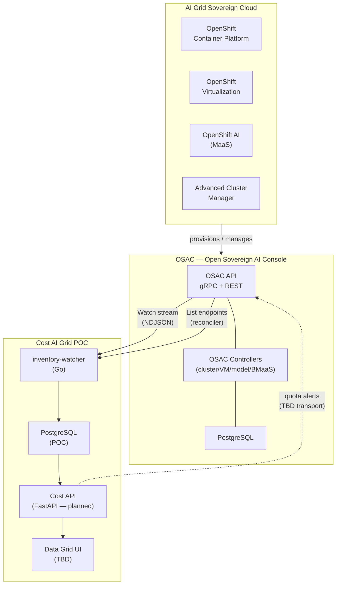
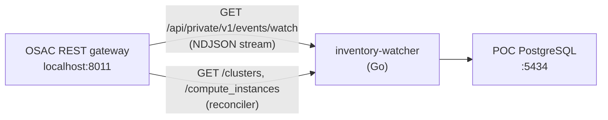
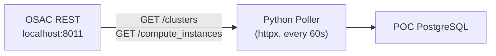
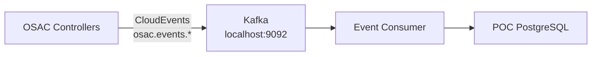

# Cost Management for AI Grid — Architecture

> **Status:** POC (Proof of Concept)
> **Goal:** A PoC-quality Cost Management on-premise instance integrated with OSAC for the AI Grid sovereign cloud blueprint.

---

## Background

The **AI Grid** is a sovereign cloud offering for customers, built on the Red Hat portfolio (OpenShift Container Platform, OpenShift Virtualization, OpenShift AI, Advanced Cluster Manager, Ansible Automation Platform).

**OSAC** (Open Sovereign AI Console) is the orchestrator: it provisions resources (clusters, VMs, models, bare metal), exposes a unified API, and emits/receives events and alerts. See: [osac-project on GitHub](https://github.com/osac-project).

**Cost Management** must integrate with OSAC to:
- Synchronize inventory (clusters, VMs, models, bare metal)
- Receive CloudEvents for resource lifecycle (replacing the Cost Management Metrics Operator)
- Perform capacity-based metering for CaaS/VMaaS
- Perform consumption-based metering for MaaS
- Manage budgets/quotas and emit threshold alerts back to OSAC

This POC explores that integration from the Cost Management side.

---

## System Context



---

## Local Development Service Map

When running the full stack locally, services are assigned ports to avoid conflicts between Koku and OSAC:

| Service | Port | Notes |
|---|---|---|
| Koku API | 8000 | Existing |
| Koku masu | 5042 | Existing |
| Koku PostgreSQL | 15432 | Existing |
| OSAC gRPC | 8010 | |
| OSAC REST gateway | 8011 | `/api/fulfillment/v1/` |
| OSAC metrics | 8012 | |
| OSAC OIDC server | 8013 | Local JWT signing |
| OSAC PostgreSQL | 5433 | |
| **inventory-watcher** | — | Go binary; connects to OSAC REST `:8011` |
| **POC PostgreSQL** | **5434** | docker-compose |
| **POC FastAPI** | **8020** | Planned REST API |
| POC Kafka | 9092 | Optional — only needed for Option C |

---

## OSAC Resource Model

OSAC organizes resources in a hierarchy:

```
Tenant
  └── Project
        └── Resource
              ├── Cluster (CaaS — HCP / OCP)
              ├── ComputeInstance (VMaaS — OpenShift Virtualization)
              ├── Model (MaaS — OpenShift AI)
              └── BareMetalInstance (BMaaS — RHEL / Windows)
```

The OSAC fulfillment service exposes these via gRPC (`osac.public.v1`) with a REST gateway:

| gRPC Service | REST Endpoint |
|---|---|
| `osac.public.v1.ClusterTemplates` | `GET /api/fulfillment/v1/cluster_templates` |
| `osac.public.v1.Clusters` | `GET /api/fulfillment/v1/clusters` |
| `osac.public.v1.ClusterOrders` | `GET /api/fulfillment/v1/cluster_orders` |
| `osac.public.v1.Events` | `GET /api/private/v1/events/watch` (NDJSON stream via REST gateway) |

---

## Event Ingestion — Options

The OSAC fulfillment service exposes a gRPC streaming `Events` service (with a REST gateway watch endpoint) and REST List APIs for inventory. Three ingestion options are viable for the POC. **Option A is the current implementation** — see [ADR-002](../decisions/002-arguments-against-kafka.md) for why Kafka is deferred.

### Option A — Watch Stream (PoC default)

The underlying transport is `osac.public.v1.Events` (gRPC streaming watch). The PoC consumes it via the REST gateway NDJSON endpoint using the Go `inventory-watcher` service, with a periodic reconciler against List endpoints.



**Pros:** Real-time events; no additional infrastructure; works today against local OSAC; reconciler catches missed events.
**Cons:** Single-consumer pattern; requires JWT auth against OSAC; not suitable if multiple independent consumers need the same event stream.

### Option B — REST Polling (fallback)



**Pros:** Simple; matches the existing CaaS/VMaaS collector scripts.
**Cons:** Snapshot-based; misses events between polls; 60s granularity.

### Option C — Kafka (optional future)



**Pros:** Decoupled fan-out; supports multiple independent consumers; event replay over long windows.
**Cons:** Requires OSAC to publish to Kafka (not implemented on OSAC side yet); adds operational overhead with no current multi-consumer requirement.

### Recommendation

Use **Option A** (Watch stream + reconciler) for the PoC and likely for production v1 — see [ADR-002](../decisions/002-arguments-against-kafka.md). The 60-second metering sweep interval is fixed by [ADR-001](../decisions/001-metering-sweep-interval.md).

Adopt **Option C** only if multiple independent consumers emerge or OSAC standardizes on Kafka as a first-class transport. Keep event ingestion behind an interface (`internal/osac/client.go` today) so the transport layer is swappable without changing the metering pipeline.

---

## Metering Model

Cost Management must support three billing models:

| Resource Type | Metering | Unit |
|---|---|---|
| Cluster (CaaS) | Capacity-based | cluster-month |
| VM (VMaaS) | Capacity-based | VM-month |
| Model (MaaS) | Consumption-based | per-million-tokens, per-million-requests |
| Bare Metal (BMaaS) | TBD | TBD |

### Capacity-Based (CaaS / VMaaS)

Charge is based on what was provisioned, not what was used. The key metrics are:
- **Control plane uptime**: `SUM(duration_seconds)` where `host_type = _control_plane`
- **Worker node time**: `SUM(worker_node_seconds)` grouped by `host_type`
- **Peak worker count**: `MAX(node_count)` per cluster per `host_type`

### Consumption-Based (MaaS)

Charge is based on actual usage:
- Tokens in / tokens out / inference tokens
- Number of requests
- Per-million-token or per-million-request rates (tiered)

---

## Data Flow

### Inventory Sync

The reconciler periodically diffs OSAC List endpoints against local inventory to catch events missed by the Watch stream:

```
OSAC REST API (reconciler, periodic)
  GET /cluster_templates  →  populate cluster_templates table
  GET /clusters           →  populate clusters table
  GET /cluster_orders     →  populate cluster_orders table
  GET /compute_instances  →  populate compute_instances table
```

### Metering Pipeline

```
OSAC Watch stream event (or Reconciler List diff)
  │
  ├── validate & parse CloudEvent (Go structs)
  ├── INSERT raw_events (dedup on ce_id)
  ├── UPSERT inventory → clusters / compute_instances / models
  │
  └── [60s sweep] if billable state → INSERT metering_entries
        ↓
      [planned] rate lookup → cost_entries
        ↓
      [planned] quota check → alerts → OSAC
```

### Alert Flow

Alert transport back to OSAC is not yet decided. A likely shape:

```
quota_consumption > threshold (e.g. 70%)
  │
  └── emit alert (transport TBD: Kafka CloudEvent, HTTP webhook, etc.)
        │
        └── OSAC receives alert → applies OPA rate limit policy
```

---


## Open Questions

| # | Question | Owner | Status |
|---|---|---|---|
| 1 | What transport will OSAC use to send CloudEvents to Cost? | OSAC + Cost | **PoC decided:** Watch stream (Option A). Production Kafka only if multi-consumer fan-out is needed — see ADR-002 |
| 2 | What Kafka topic names will OSAC use? | OSAC | Open — relevant only if Option C is adopted |
| 3 | Will OSAC define CloudEvents for MaaS and BMaaS? | OSAC | Open |
| 4 | Where do quotas/budgets live — OSAC, Cost, or both? | OSAC + Cost | Open |
| 5 | Where do cost tiers live — OSAC, Cost, or both? | OSAC + Cost | Open |
| 6 | How will quota alerts be communicated to OSAC? (Kafka CloudEvents? HTTP callback?) | OSAC + Cost | Open |
| 7 | Does OSAC have a concept of projects within tenants that Cost needs to track? | OSAC + Cost | **Resolved:** yes — `projects` table populated; see REQ-3a |
| 8 | UI requirements for the data grid? | Cost | TBD |

---

## References

- [OSAC Project GitHub](https://github.com/osac-project)
- [OSAC Fulfillment Service](https://github.com/osac-project/fulfillment-service)
- [OSAC Metering Discover POC](https://github.com/masayag/osac-metering-discover-poc)
- [OSAC Console Mockups](https://heyethankim.github.io/osac-demo/)
- [docs/dev/local-dev-setup.md](../dev/local-dev-setup.md) — local dev setup guide
- [docs/requirements/ai_grid_poc_requirements_brief.md](../requirements/ai_grid_poc_requirements_brief.md) — requirements spike
- [ADR-001: Metering sweep interval](../decisions/001-metering-sweep-interval.md)
- [ADR-002: Watch stream instead of Kafka](../decisions/002-arguments-against-kafka.md)
